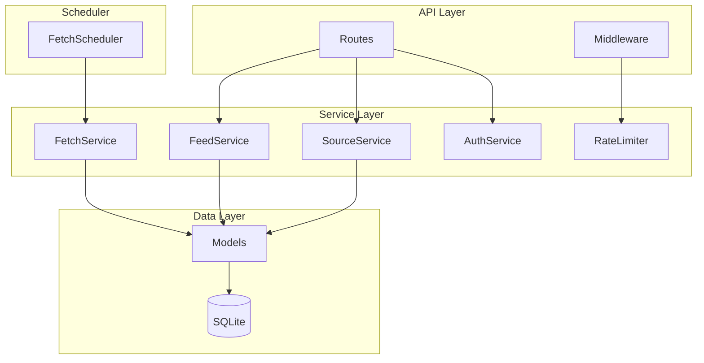

# Design Document

## Overview

RSS Aggregator is a monolithic FastAPI application that aggregates multiple RSS/Atom feeds into a unified RSS 2.0 output. It features scheduled background fetching, API-based source management, filtering, and sorting capabilities.

## Steering Document Alignment

### Technical Standards (tech.md)

- Uses Python 3.12 with FastAPI for async web framework
- SQLite for persistent storage as specified
- uv for package management
- Monolithic architecture as decided

### Project Structure (structure.md)

Follows layered architecture with clear separation:
- `src/api/` - API routes and middleware
- `src/services/` - Business logic
- `src/models/` - Data models
- `src/db/` - Database operations
- `src/scheduler/` - Background tasks

## Code Reuse Analysis

This is a greenfield project. No existing code to leverage.

### Existing Components to Leverage

- **FastAPI**: Built-in dependency injection, routing, and OpenAPI docs
- **SQLAlchemy**: ORM patterns and async support
- **APScheduler**: Background job scheduling

### Integration Points

- **External RSS Feeds**: HTTP client (httpx) for fetching
- **Database**: SQLite via SQLAlchemy async engine
- **Cloud Run**: Container deployment with health checks

## Architecture



## Components and Interfaces

### API Layer

#### Routes
- **Purpose:** Handle HTTP requests and responses
- **Interfaces:** FastAPI router endpoints
- **Dependencies:** Services, Middleware

#### Middleware
- **Purpose:** Rate limiting, authentication
- **Interfaces:** Starlette middleware
- **Dependencies:** AuthService, RateLimiter

### Service Layer

#### FeedService
- **Purpose:** Aggregate and filter RSS items
- **Interfaces:** `get_aggregated_feed(sort_by, sort_order, valid_time, keywords)`
- **Dependencies:** Database, FeedItem model
- **Reuses:** None

#### SourceService
- **Purpose:** Manage RSS sources
- **Interfaces:** `create_source()`, `get_sources()`, `update_source()`, `delete_source()`
- **Dependencies:** Database, Source model
- **Reuses:** None

#### FetchService
- **Purpose:** Fetch and parse RSS feeds
- **Interfaces:** `fetch_source()`, `fetch_all()`, `parse_rss()`
- **Dependencies:** httpx, feedparser, SourceService
- **Reuses:** None

#### AuthService
- **Purpose:** Validate API keys
- **Interfaces:** `validate_key()`
- **Dependencies:** Database, APIKey model
- **Reuses:** None

#### RateLimiter
- **Purpose:** Track and enforce rate limits
- **Interfaces:** `is_allowed()`, `get_remaining()`, `get_reset_time()`
- **Dependencies:** None (in-memory)
- **Reuses:** None

### Scheduler

#### FetchScheduler
- **Purpose:** Periodically check and fetch sources
- **Interfaces:** `start()`, `stop()`, `refresh_source()`, `refresh_all()`
- **Dependencies:** FetchService
- **Reuses:** APScheduler patterns

## Data Models

### Source
```python
class Source:
    id: int  # Primary key
    name: str  # Display name
    url: str  # RSS URL (unique)
    fetch_interval: int  # Seconds between fetches (default: 900)
    is_active: bool  # Whether to include in aggregation
    last_fetched_at: datetime | None  # Last successful fetch time
    last_error: str | None  # Last error message
    created_at: datetime
    updated_at: datetime
    deleted_at: datetime | None  # Soft delete
```

### APIKey
```python
class APIKey:
    id: int  # Primary key
    key: str  # API key value (unique)
    name: str | None  # Friendly name
    is_active: bool  # Whether key is valid
    created_at: datetime
    updated_at: datetime
    deleted_at: datetime | None  # Soft delete
```

### FeedItem
```python
class FeedItem:
    id: int  # Primary key
    source_id: int  # Foreign key to Source
    title: str  # Item title
    link: str  # Item URL
    description: str | None  # Item content/summary
    published_at: datetime | None  # Publication date
    fetched_at: datetime  # When we fetched it
    created_at: datetime
    updated_at: datetime
    deleted_at: datetime | None  # Soft delete
```

### ErrorLog
```python
class ErrorLog:
    id: int  # Primary key
    source_id: int | None  # Related source (nullable)
    error_type: str  # Error class name
    error_message: str  # Error details
    created_at: datetime
    updated_at: datetime
    deleted_at: datetime | None  # Soft delete
```

### Stats
```python
class Stats:
    id: int  # Primary key
    date: date  # Unique per day
    total_requests: int  # API request count
    successful_fetches: int  # Successful RSS fetches
    failed_fetches: int  # Failed RSS fetches
    created_at: datetime
    updated_at: datetime
    deleted_at: datetime | None  # Soft delete
```

## Error Handling

### Error Scenarios

1. **RSS Fetch Failure**
   - **Handling:** Retry N times with delay, then log error
   - **User Impact:** Source items not included in feed, error logged

2. **Invalid API Key**
   - **Handling:** Return 401 with error message
   - **User Impact:** Request denied, must provide valid key

3. **Rate Limit Exceeded**
   - **Handling:** Return 429 with Retry-After header
   - **User Impact:** Request denied, must wait before retrying

4. **Source Not Found**
   - **Handling:** Return 404 with error message
   - **User Impact:** Operation failed, source may have been deleted

5. **Validation Error**
   - **Handling:** Return 422 with field details
   - **User Impact:** Request rejected, must fix input

## Testing Strategy

### Unit Testing

- Test each service method in isolation
- Mock database and external dependencies
- Test edge cases: empty results, invalid inputs, errors

### Integration Testing

- Test API endpoints with test database
- Test authentication and rate limiting middleware
- Test feed aggregation end-to-end

### End-to-End Testing

- Test complete user flows:
  - Add source → fetch → retrieve feed
  - Filter by time and keywords
  - API key management